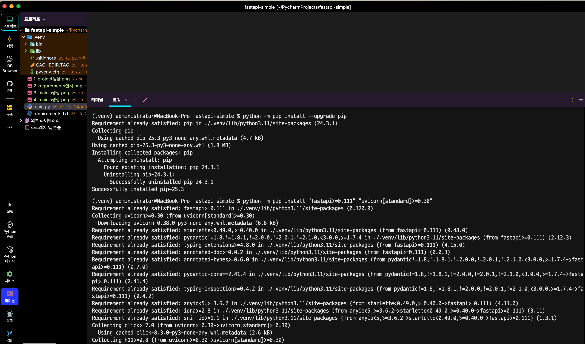
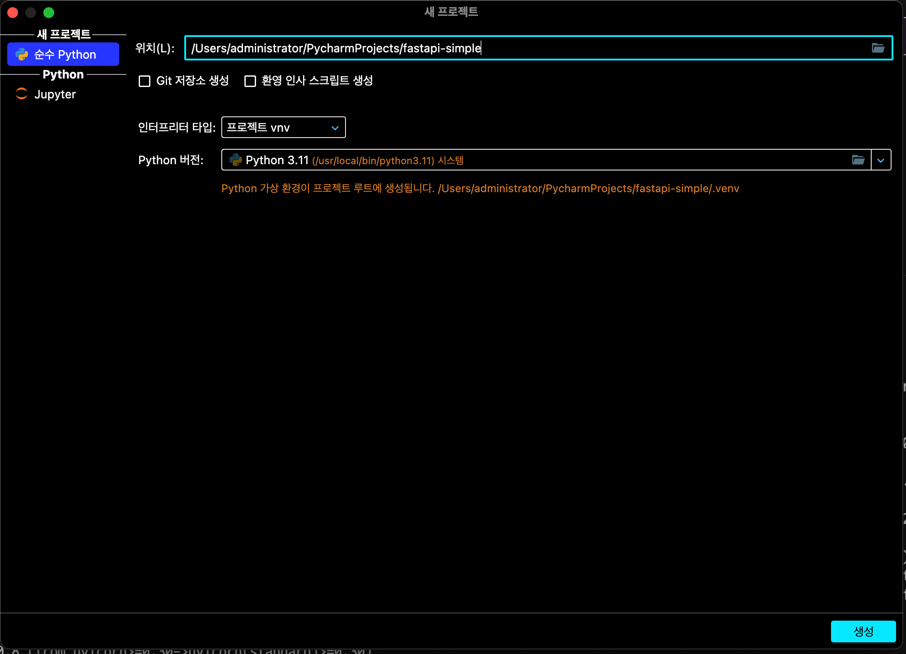
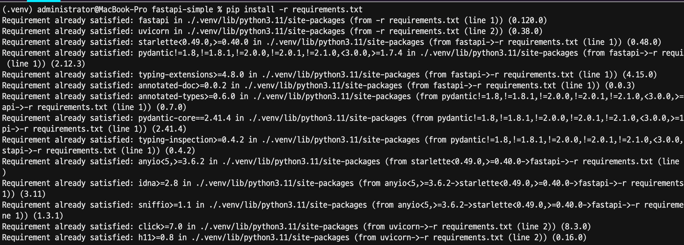
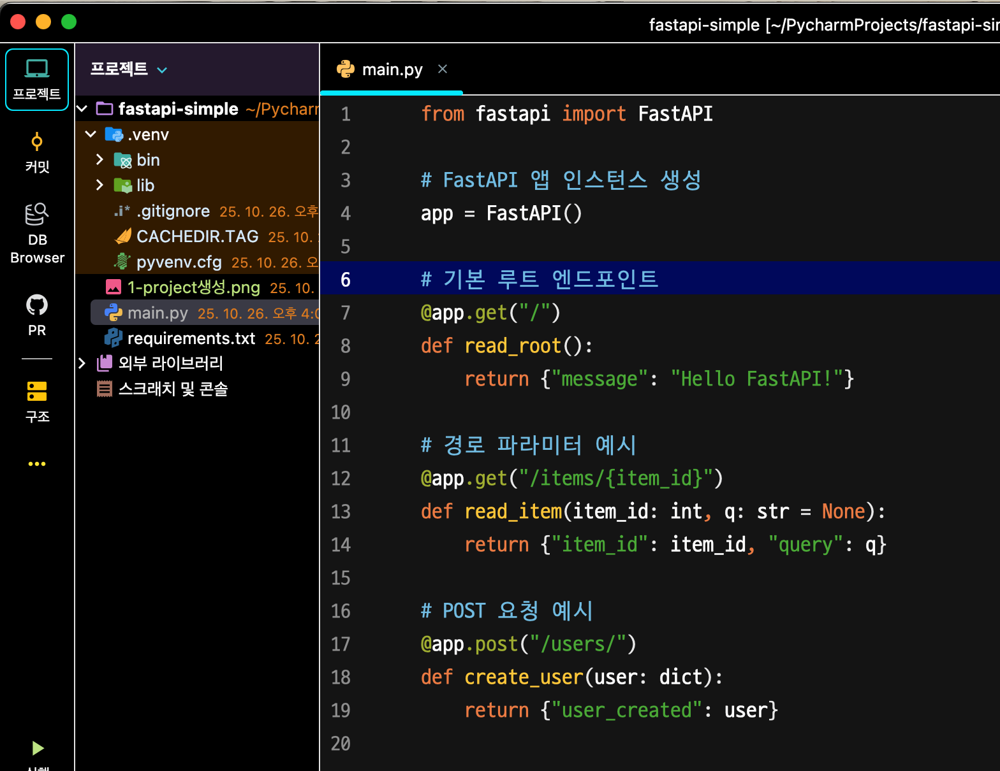
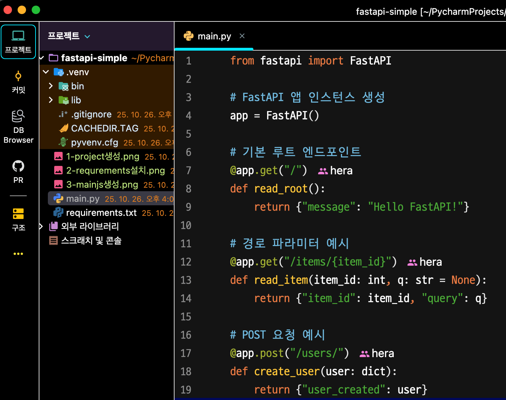
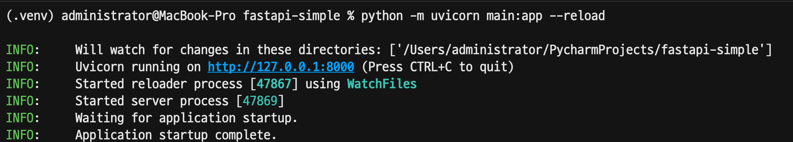

# FastAPI-Simple 프로젝트

FastAPI를 사용한 간단한 API 서버 구축 프로젝트입니다.

## 설치 및 설정 가이드

### 1. 터미널에서 pip 설치 확인


### 2. 프로젝트 생성


### 3. requirements.txt 설치


### 4. main.py 생성 및 기본 코드 작성


### 5. main.py 코드 구현


### 6. Unicorn 서버 실행


## 프로젝트 구조
```
fastapi-simple/
├── main.py              # FastAPI 메인 애플리케이션 파일
├── requirements.txt     # 프로젝트 의존성 파일
└── __pycache__/        # Python 캐시 디렉토리
```

## 실행 방법

1. 의존성 설치:
```bash
pip install -r requirements.txt
```

2. 서버 실행:
```bash
uvicorn main:app --reload
```

## API 문서
서버 실행 후 다음 URL에서 API 문서를 확인할 수 있습니다:
- Swagger UI: http://localhost:8000/docs
- ReDoc: http://localhost:8000/redoc