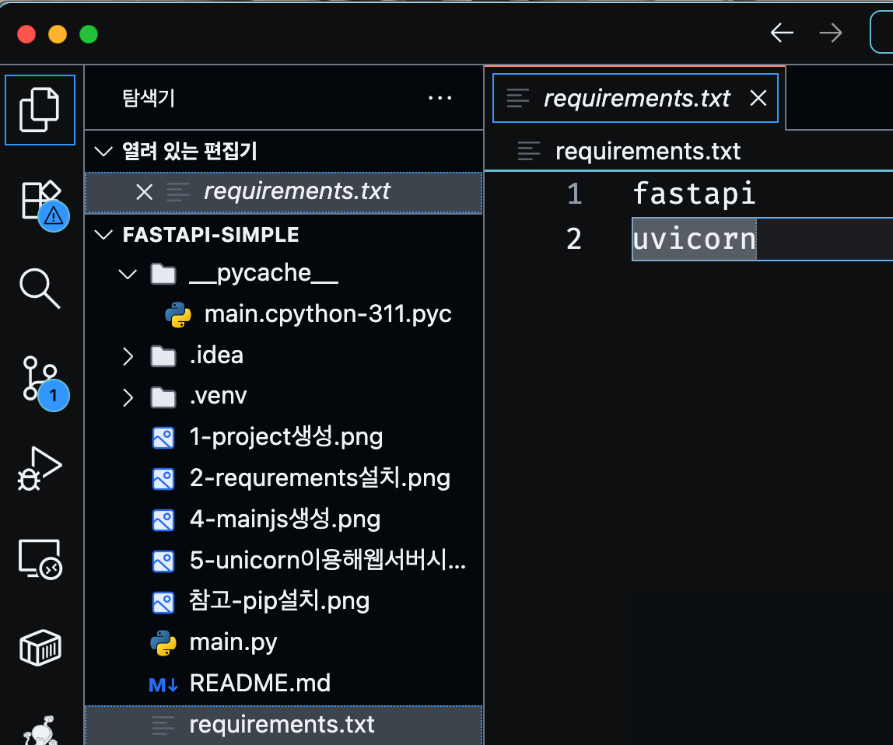
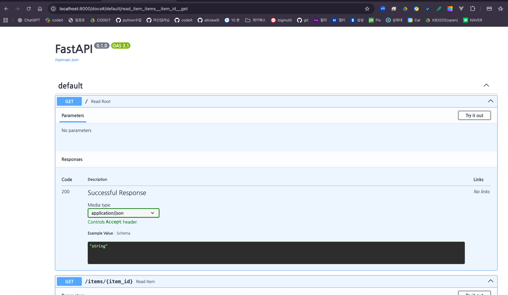
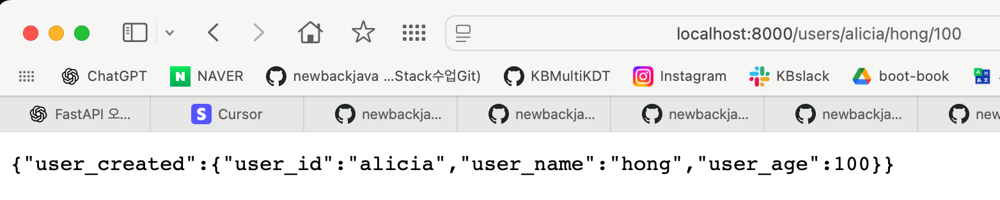

# FastAPI-Simple 프로젝트

FastAPI를 사용한 간단한 API 서버 구축 프로젝트입니다.

## 설치 및 설정 가이드

### 1. 프로젝트 생성


### 2. requirements.txt 생성


```
fastapi
uvicorn

```

### 3. requirements.txt 설치


```bash
pip install -r requirements.txt
```


### 4. main.py 생성 및 기본 코드 작성


```
from fastapi import FastAPI

# FastAPI 앱 인스턴스 생성
app = FastAPI()

# 기본 루트 엔드포인트
@app.get("/")
def read_root():
    return {"message": "Hello FastAPI!"}

# 경로 파라미터 예시
@app.get("/items/{item_id}")
def read_item(item_id: int, q: str = None):
    return {"item_id": item_id, "query": q}

# POST 요청 예시
@app.post("/users/")
def create_user(user: dict):
    return {"user_created": user}


```

### 5. Unicorn 서버 실행


```bash
python -m uvicorn main:app --reload
```

## 프로젝트 구조
```
fastapi-simple/
├── main.py              # FastAPI 메인 애플리케이션 파일
├── requirements.txt     # 프로젝트 의존성 파일
└── __pycache__/        # Python 캐시 디렉토리
```

## 실행 방법

### SSL 오류 해결 (필요한 경우)
만약 다음과 같은 SSL 오류가 발생하는 경우:
```
WARNING: pip is configured with locations that require TLS/SSL, however the ssl module in Python is not available.
```

macOS의 경우:
```bash
brew install openssl
export LDFLAGS="-L/usr/local/opt/openssl/lib"
export CPPFLAGS="-I/usr/local/opt/openssl/include"
python -m pip install --upgrade pip
```

### 의존성 설치
```bash
pip install -r requirements.txt
```

SSL 오류가 계속되는 경우 아래 명령어를 사용해보세요:
```bash
pip install --trusted-host pypi.org --trusted-host files.pythonhosted.org -r requirements.txt
```

2. 서버 실행:
```bash
python -m uvicorn main:app --reload
```

## API 문서
서버 실행 후 다음 URL에서 API 문서를 확인할 수 있습니다:
- Swagger UI: http://localhost:8000/docs




-> curl명령어로 터미널(명령 프롬프트)에서 테스트해보자.!!


-> postman에 주소 등록하고 http method별로 테스트해보자.!!

- ReDoc: http://localhost:8000/redoc

<hr>

## :smile 수정해보자



```
# 경로 파라미터 예시
@app.get("/items/{item_id}")
def read_item(item_id: int):
    return {"item_id": item_id}

# POST 요청 예시
# @app.post("/users/")
@app.get("/users/{user_id}/{user_name}/{user_age}")
def create_user(user_id: str, user_name: str, user_age: int):
    user = {
        "user_id": user_id,
        "user_name": user_name,
        "user_age": user_age
    }
    return {"user_created": user}# 경로 파라미터 예시


```
